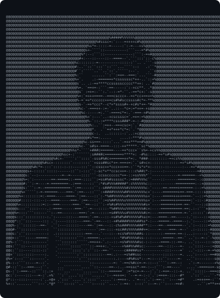

  <!-- Terminal Top Row: ASCII Portrait & Neofetch Info Card -->
  <h3><code>saketh@github ~ $ whoami</code></h3>

  <table>
    <tr>
      <td valign="top"></td>
      <td valign="top"></td>
      
    </tr>
  </table>

    

  <!-- Animated Contribution Graph -->
  <h3><code>saketh@github ~ $ ./contributions.sh</code></h3>

  

    

  <!-- Links & Social Badges -->
  <h3><code>saketh@github ~ $ ./links.sh</code></h3>

  
<b>AI/ML Engineer · Fullstack Developer · Electronics & Computer Engineering</b>

  
  
  

   

